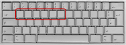

# Typing_RTs_JS: Little helper functions to collect typewritten reaction time data using JavaScript

JavaScript code (a) to screen for a specific type of computer keyboard and (b) to collect typewritten responses (keypresses and reaction times) in a picture naming task.

## Keyboard screening
When running reaction time-sensitive experiments with typewritten responses, you may want to ensure that all relevant characters have direct keys and that key  positions are identical between participants. Therefore, you may want to screen for the keyboard a participant uses. [Here](https://github.com/kirstenstark/typing_RTs_JS/blob/master/qwertz_keyboard_screen.html) is one JavaScript-based solution to screen for a QWERTZ-keyboard. It can easily be adapted to other keyboard types and implemented to your experimentatal platform, as long as it accepts JavaScript code.  
The underlying idea is to compare the event.key and event.code of characters specific to a certain language and keyboard position. 

(Keyboard keys defining the keyboard
layout name, in our case QWERTZ)

## Typing RTs
[Here](https://github.com/kirstenstark/typing_RTs_JS/blob/master/typing_rts_JS) you can find a function that allows to detect and save keystrokes and keystroke latencies using JavaScript. The function can be either loaded in your script or the source code can be copy-pasted and adapted.  
We recommend to present your stimulus and start the timer only after the page has been fully loaded, e.g. by using the *window.onlad()* JS function. For an example, check out our SoSciSurvey ([Leiner,2019](https://www.soscisurvey.de/)) implementation below. 

### Implementations
We computed our [experiment](add-link-to-preprint-here) in SoSciSurvey. [Here](https://github.com/kirstenstark/typing_RTs_JS/tree/master/implementation) you can find the relevant code bits of the main experimental task, including the timing of picture presentation and the function presented above.  Adding a jsPsych implementation is planned. 

## Citation

If you decide to use this codde, I'd be happy if you would cite it: Stark, K. (2021). Stringmatch_typed_naming. GitHub Repository. [https://github.com/kirstenstark/typing_RTs_JS](https://github.com/kirstenstark/typing_RTs_JS)

### Any comments, suggestions, extensions?

... please let me know!
